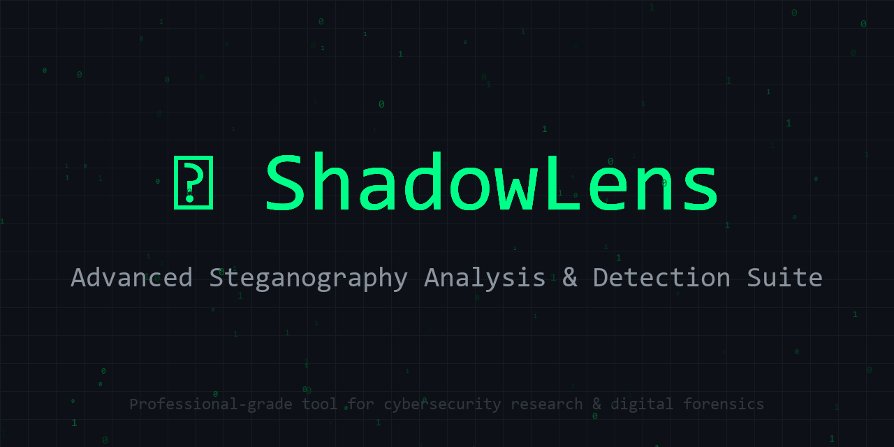

# 🔍 ShadowLens

[](https://www.python.org/downloads/)
[](LICENSE)
[]()
[](https://streamlit.io)

> **Advanced Steganography Analysis & Detection Suite**

ShadowLens is a professional-grade steganography tool designed for cybersecurity researchers, digital forensics specialists, and security professionals. It combines 9 detection algorithms with 6 embedding methods in a sleek, intuitive interface.



---

## ✨ Features

### 🔬 Detection Algorithms (9 Methods)

| Method | Description | Research Base |
|--------|-------------|---------------|
| **LSB Analysis** | Extracts LSBs and analyzes randomness patterns | Statistical steganalysis |
| **Chi-Square Attack** | Detects LSB embedding via statistical hypothesis testing | Westfeld & Pfitzmann (1999) |
| **RS Analysis** | Regular-Singular analysis for payload estimation | Fridrich et al. (2001) |
| **Sample Pairs** | Analyzes adjacent pixel relationships | Dumitrescu et al. (2002) |
| **Histogram Analysis** | Detects histogram flattening artifacts | Visual detection |
| **Noise Estimation** | Laplacian variance for noise level analysis | Image forensics |
| **DCT Analysis** | JPEG coefficient distribution analysis | JSteg detection |
| **Metadata Analysis** | EXIF inspection and anomaly detection | File structure analysis |
| **Combined Scoring** | Weighted aggregation with confidence verdict | Multi-factor analysis |

### 🔒 Embedding Methods (6 Methods)

- ✅ **LSB Steganography** — 1-3 bits per channel, channel selection
- ✅ **Encrypted LSB** — AES-256-GCM + PBKDF2 password protection
- ✅ **Spread Spectrum** — PRNG-seeded distributed embedding
- ✅ **Audio LSB** — WAV file steganography (mono/stereo)
- ✅ **Text Zero-Width** — Invisible character encoding
- ✅ **Text Whitespace** — Trailing space/tab encoding
- ✅ **Alpha Channel** — Hide images in PNG transparency

---

## 🚀 Quick Start

### Installation

```bash
# Clone the repository
git clone https://github.com/yourusername/ShadowLens.git
cd ShadowLens

# Install dependencies
pip install -r requirements.txt

# Generate test samples (optional)
python samples/generate_samples.py

# Launch the application
streamlit run app.py
```

### Requirements

- Python 3.9+
- Streamlit 1.29+
- Pillow, NumPy, SciPy
- Plotly, OpenCV, scikit-image
- Cryptography library

---

## 📖 Usage Guide

### Page 1: Analyze (Detection)

Upload any image to run comprehensive steganalysis:

1. Navigate to **📊 Analyze** page
2. Upload image (PNG, BMP, TIFF, JPG supported)
3. Click **"Run Full Analysis"**
4. Review individual test results and combined verdict
5. Download HTML report for documentation

**Verdict System:**
- 🟢 **CLEAN** — No steganographic indicators detected
- 🟡 **SUSPICIOUS** — Some anomalies warrant further investigation
- 🔴 **LIKELY EMBEDDED** — Strong evidence of hidden data

### Page 2: Hide (Embedding)

Embed secret messages in images:

1. Go to **📝 Hide** page
2. Upload cover image (PNG/BMP/TIFF recommended)
3. Select embedding method
4. Enter message or upload secret file
5. Configure options (channels, bits, password)
6. Download stego image

**Capacity Display:** Shows available space and utilization percentage.

### Page 3: Extract (Recovery)

Extract hidden data from suspected stego files:

1. Navigate to **🔓 Extract** page
2. Upload stego file
3. Select method or use auto-detect
4. Enter password if encrypted
5. View or download extracted content

### Page 4: Bit Planes (Visual Analysis)

Examine individual bit planes for visual steganalysis:

1. Go to **🔬 Bit Planes** page
2. Upload image
3. View all 24 bit planes (8 per RGB channel)
4. Identify suspicious patterns in LSB planes

### Page 5: About

Access technical documentation, algorithm references, and ethical use guidelines.

---

## 🔬 Technical Details

### Cryptographic Implementation

```
Encryption: AES-256-GCM
Key Derivation: PBKDF2-HMAC-SHA256
Iterations: 600,000 (OWASP recommended)
Salt: 32 bytes (random)
IV: 12 bytes (random)
Authentication: GCM tag (16 bytes)
```

### Detection Algorithm Formulas

#### Chi-Square Attack
```
χ² = Σ (Oᵢ - Eᵢ)² / Eᵢ

Where:
  Oᵢ = Observed frequency of pixel value pairs
  Eᵢ = Expected frequency under uniform distribution
  
p-value < 0.05 indicates suspicious non-uniformity
```

#### RS Analysis (Fridrich et al.)
```
Discrimination function: f(G) = |u₁ - u₂| + |u₂ - u₃| + |u₃ - u₄|

For mask M = [0,1,1,0]:
  Rₘ = count of groups where f(M(G)) > f(G)
  Sₘ = count of groups where f(M(G)) < f(G)
  
Estimated message length derived from Rₘ, Sₘ, R₋ₘ, S₋ₘ
```

#### Sample Pairs Analysis
```
For adjacent pixels (u, v):
  P = {(u,v): v even, u<v} ∪ {(u,v): v odd, u>v}
  Q = {(u,v): v even, u>v} ∪ {(u,v): v odd, u<v}
  
Embedding rate estimated from |P - Q| / (|P| + |Q|)
```

---

## 🏗️ Architecture

```
ShadowLens/
├── app.py                  # Streamlit UI application
├── requirements.txt        # Python dependencies
├── README.md              # This file
├── .gitignore            # Git ignore rules
├── assets/
│   └── banner.png        # Project banner
├── core/                 # Core engine modules
│   ├── __init__.py
│   ├── analyzer.py       # 9 detection algorithms
│   ├── embedder.py       # 6 embedding methods
│   ├── extractor.py      # Multi-method extraction
│   ├── crypto.py         # AES-256-GCM encryption
│   ├── report.py         # HTML report generation
│   └── utils.py          # Shared utilities
└── samples/              # Test data generator
    └── generate_samples.py
```

---

## 📊 Sample Output

### Analysis Report Example

```
═══════════════════════════════════════════
🔍 ShadowLens Analysis Report
test_image.png | 2.4 MB | 1920×1080
═══════════════════════════════════════════

🟡 VERDICT: SUSPICIOUS (Confidence: 73.2%)

Overall Suspicion Score: 68.5%

┌─ Detection Results ─────────────────────┐
│ LSB Analysis:        🟡 78.3% suspicious│
│ Chi-Square:           🟢 12.1%          │
│ RS Analysis:          🟡 45.7% payload │
│ Sample Pairs:         🟡 38.2% rate     │
│ Histogram:            🟢 23.4%          │
│ Noise Estimation:     🟢 15.6%          │
│ DCT Analysis:         ⚪ N/A (PNG)      │
│ Metadata:             🟢 Clean          │
└─────────────────────────────────────────┘

Estimated Payload: ~12.3% of image capacity
Recommendation: Further investigation warranted
```

---

## ⚖️ Ethical Use Statement

ShadowLens is designed for legitimate security purposes:

- ✅ Security research and education
- ✅ Digital forensics investigations
- ✅ Penetration testing (authorized)
- ✅ Steganography algorithm development
- ✅ Academic research

**Prohibited uses:**
- ❌ Concealing illegal content
- ❌ Bypassing security without authorization
- ❌ Malicious data exfiltration
- ❌ Copyright circumvention

Users are responsible for complying with all applicable laws. The developers assume no liability for misuse.

---

## 📚 References

1. **Westfeld, A., & Pfitzmann, A.** (1999). Attacks on Steganographic Systems. In *Information Hiding* (LNCS 1768, pp. 61-76). Springer.

2. **Fridrich, J., Goljan, M., & Du, R.** (2001). Detecting LSB Steganography in Color and Gray-Scale Images. *IEEE MultiMedia*, 8(4), 22-28.

3. **Dumitrescu, S., Wu, X., & Wang, Z.** (2002). Detection of LSB Steganography via Sample Pair Analysis. *IEEE Transactions on Signal Processing*, 51(7), 1995-2007.

4. **Provos, N., & Honeyman, P.** (2003). Hide and Seek: An Introduction to Steganography. *IEEE Security & Privacy*, 1(3), 32-44.

5. **Cachin, C.** (2004). An Information-Theoretic Model for Steganography. *Information and Computation*, 192(1), 41-56.

---

## 🤝 Contributing

Contributions welcome! Areas of interest:

- Additional detection algorithms (SPA, Laplacian)
- Support for more image formats (WebP, HEIC)
- Deep learning-based detection
- Performance optimizations
- UI/UX improvements
- Documentation translations

Please submit pull requests with:
- Clear description of changes
- Tests for new functionality
- Updated documentation

---

## 📄 License

MIT License

Copyright (c) 2024 ShadowLens Contributors

Permission is hereby granted, free of charge, to any person obtaining a copy
of this software and associated documentation files (the "Software"), to deal
in the Software without restriction, including without limitation the rights
to use, copy, modify, merge, publish, distribute, sublicense, and/or sell
copies of the Software, and to permit persons to whom the Software is
furnished to do so, subject to the following conditions:

The above copyright notice and this permission notice shall be included in all
copies or substantial portions of the Software.

THE SOFTWARE IS PROVIDED "AS IS", WITHOUT WARRANTY OF ANY KIND, EXPRESS OR
IMPLIED, INCLUDING BUT NOT LIMITED TO THE WARRANTIES OF MERCHANTABILITY,
FITNESS FOR A PARTICULAR PURPOSE AND NONINFRINGEMENT.

---

## 🙏 Acknowledgments

- OpenCV and scikit-image communities for image processing tools
- Plotly team for interactive visualization
- Streamlit for the amazing web app framework
- Academic researchers in steganography and steganalysis

---

<p align="center">
  <strong>🔍 ShadowLens — See What Others Hide</strong><br>
  <sub>Built with 💚 for the cybersecurity community</sub>
</p>
